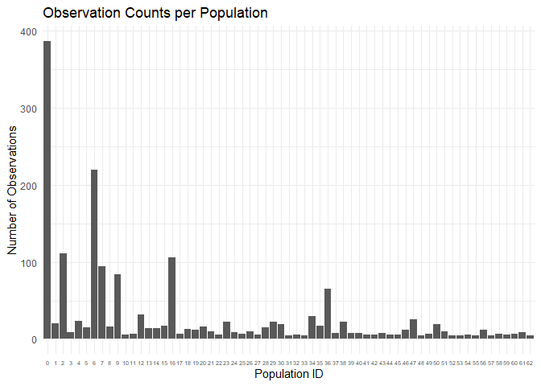
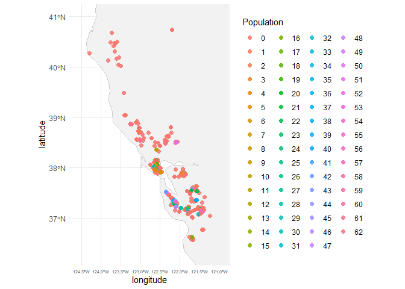
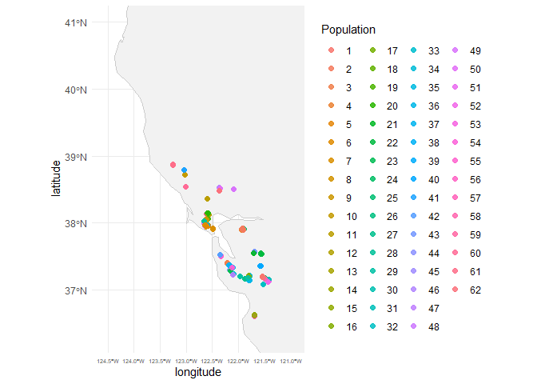

# Lepto_iNat_Pops

------------------------------------------------------------------------

## Set up Working Directory and Install/Library Packages

``` r
#install.packages("dbscan")
#install.packages("sf")
#install.packages(("ggspatial"))
#install.packages("rnaturalearthdata")
library(dbscan)
library(sf)
library(dplyr)
library(ggplot2)
library(ggspatial)
library(rnaturalearth)
```

------------------------------------------------------------------------

## Read in CSV from iNat (*Leptosiphon androsaceus*)

``` r
LA <- read.csv("LAndro_iNat.csv")
names(LA)
```

    [1] "id"              "url"             "image_url"       "latitude"       
    [5] "longitude"       "scientific_name"

------------------------------------------------------------------------

## Convert from Degrees to Meters, set up Pops

``` r
#Convert to sf object
LA_sf <- st_as_sf(LA, coords = c("longitude", "latitude"), crs = 4326)

#Project to meters
LA_utm <- st_transform(LA_sf, 32611)  # change UTM zone if needed
coords <- st_coordinates(LA_utm)
```

------------------------------------------------------------------------

## Run dbscan and add Pops column to CSV

``` r
#Run DBSCAN, 500 m radius populations with 5 or more observations per pop
db <- dbscan(coords, eps = 500, minPts = 5)  

#Add population column
LA$population_id <- db$cluster
```

------------------------------------------------------------------------

## Check if it worked

``` r
table(LA$population_id)
```


      0   1   2   3   4   5   6   7   8   9  10  11  12  13  14  15  16  17  18  19 
    387  20 111   9  23  15 220  94  16  84   6   7  32  14  14  17 106   7  13  12 
     20  21  22  23  24  25  26  27  28  29  30  31  32  33  34  35  36  37  38  39 
     16  10   6  22   9   7  10   6  15  22  19   5   6   5  30  17  65   8  22   8 
     40  41  42  43  44  45  46  47  48  49  50  51  52  53  54  55  56  57  58  59 
      8   6   6   8   6   6  12  26   5   7  19  10   5   5   6   5  12   5   7   6 
     60  61  62 
      7   9   5 

``` r
sum(LA$population_id == 0)
```

    [1] 387

------------------------------------------------------------------------

## Save CSV

``` r
write.csv(LA, "LAndro_iNat_Pops.csv", row.names = FALSE)
```

------------------------------------------------------------------------

## Visualize data

### NOTE: All observations beloning to population ‘0’ are singelton observations, that did not meet our population criteria (5 obs within 500 m)

``` r
#List pop sizes
pop_sizes <- LA %>%
  count(population_id, name = "n_obs") %>%
  arrange(desc(n_obs))

pop_sizes
```

       population_id n_obs
    1              0   387
    2              6   220
    3              2   111
    4             16   106
    5              7    94
    6              9    84
    7             36    65
    8             12    32
    9             34    30
    10            47    26
    11             4    23
    12            23    22
    13            29    22
    14            38    22
    15             1    20
    16            30    19
    17            50    19
    18            15    17
    19            35    17
    20             8    16
    21            20    16
    22             5    15
    23            28    15
    24            13    14
    25            14    14
    26            18    13
    27            19    12
    28            46    12
    29            56    12
    30            21    10
    31            26    10
    32            51    10
    33             3     9
    34            24     9
    35            61     9
    36            37     8
    37            39     8
    38            40     8
    39            43     8
    40            11     7
    41            17     7
    42            25     7
    43            49     7
    44            58     7
    45            60     7
    46            10     6
    47            22     6
    48            27     6
    49            32     6
    50            41     6
    51            42     6
    52            44     6
    53            45     6
    54            54     6
    55            59     6
    56            31     5
    57            33     5
    58            48     5
    59            52     5
    60            53     5
    61            55     5
    62            57     5
    63            62     5

``` r
#Bar plot of pop sizes
ggplot(pop_sizes, aes(x = factor(population_id), y = n_obs)) +
  geom_col() +
  labs(x = "Population ID",
       y = "Number of Observations",
       title = "Observation Counts per Population") +
  theme_minimal() +
  theme(axis.text.x = element_text(size = 5))
```



------------------------------------------------------------------------

## Visualize pops on a map

``` r
# Get world basemap
world <- ne_countries(scale = "medium", returnclass = "sf")

# Bounding box around our data
bbox <- c(
  xmin = min(LA$longitude) - 0.5,
  xmax = max(LA$longitude) + 0.5,
  ymin = min(LA$latitude) - 0.5,
  ymax = max(LA$latitude) + 0.5
)

# Plot
ggplot() +
  geom_sf(data = world, fill = "gray95", color = "gray80") +
  geom_point(data = LA,
             aes(x = longitude, y = latitude,
                 color = factor(population_id)),
             size = 2, alpha = 0.85) +
  coord_sf(xlim = c(bbox["xmin"], bbox["xmax"]),
           ylim = c(bbox["ymin"], bbox["ymax"]),
           expand = FALSE) +
  labs(color = "Population") +
  theme_minimal() +
  theme(axis.text.x = element_text(size = 5))
```



##Lets remove noise from ‘pop 0’ singelton observation

``` r
# Remove noise points (population_id == 0)
LA_clean <- LA %>%
  filter(population_id != 0)

# Quick check
table(LA_clean$population_id)
```


      1   2   3   4   5   6   7   8   9  10  11  12  13  14  15  16  17  18  19  20 
     20 111   9  23  15 220  94  16  84   6   7  32  14  14  17 106   7  13  12  16 
     21  22  23  24  25  26  27  28  29  30  31  32  33  34  35  36  37  38  39  40 
     10   6  22   9   7  10   6  15  22  19   5   6   5  30  17  65   8  22   8   8 
     41  42  43  44  45  46  47  48  49  50  51  52  53  54  55  56  57  58  59  60 
      6   6   8   6   6  12  26   5   7  19  10   5   5   6   5  12   5   7   6   7 
     61  62 
      9   5 

``` r
ggplot() +
  geom_sf(data = world, fill = "gray95", color = "gray80") +
  geom_point(data = LA_clean,
             aes(x = longitude, y = latitude,
                 color = factor(population_id)),
             size = 2, alpha = 0.85) +
  coord_sf(xlim = c(bbox["xmin"], bbox["xmax"]),
           ylim = c(bbox["ymin"], bbox["ymax"]),
           expand = FALSE) +
  labs(color = "Population") +
  theme_minimal() +
   theme(axis.text.x = element_text(size = 5))
```



------------------------------------------------------------------------

##Finish and Save

``` r
# Save to new CSV
write.csv(LA_clean, "LAndro_iNat_Pops_filtered.csv", row.names = FALSE)
```
